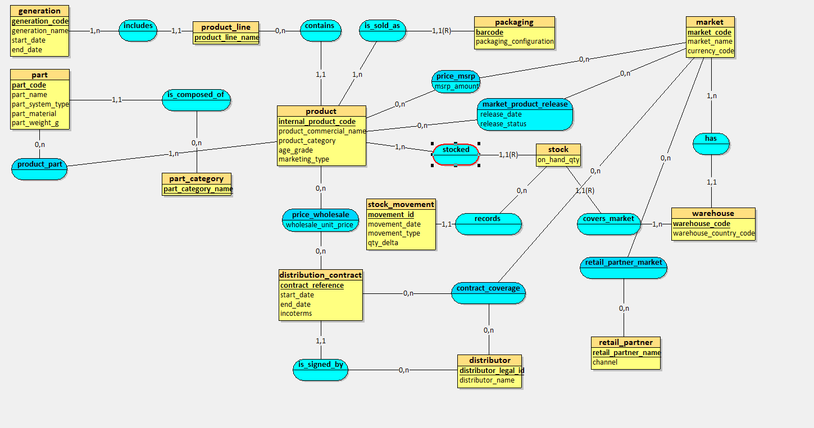

# Projet-DB-JEHCHI
Database project

# TI404 — Databases 1 (Basic Concepts)
## Mini-Project — MERISE Database Design (Part 1)
### Domain: **Hasbro — Beyblade Toys Division**

---

## 1. Introduction

This mini-project applies the **MERISE method** to design an information system database.

The chosen domain is the **Beyblade Toys Division** of a multinational toy manufacturer (inspired by Hasbro/Bandai).  
The system must support management of **product generations**, **product lines**, **toy products**, **interchangeable parts**, **international markets**, **distribution contracts**, **pricing**, and **warehouse stock**.

This README contains the deliverables for **Part 1**:

- Final prompt used to gather requirements  
- Business rules (as spoken by the business)  
- Raw data dictionary (25–35 items)  
- MCD (conceptual model) overview + advanced elements used  

---

## 2. Data Business Rules (as spoken by the business)

The Beyblade brand is managed by product generations (e.g., a generation has a name, a start date, and an end date when applicable).

Each generation includes multiple product lines (examples: starter tops, boosters, stadium sets, launcher sets, accessories).

A Beyblade model is a sellable toy reference marketed under a commercial name and a unique internal product code.

A Beyblade model can be sold as different pack configurations (single top, top + launcher, stadium set, gift set), each with its own retail barcode.

A Beyblade model is composed of interchangeable parts (e.g., layer/energy chip/forge disc/driver depending on the system), and a part can be used in multiple models.

Each part belongs to a part category (attack/defense/stamina/balance or equivalent system categories) and may have a material type.

A Beyblade model is associated with a recommended series/type for marketing (for example: Attack-type), even if parts can be mixed by users.

Launchers and stadiums are products as well, with their own product codes, packaging, and barcodes.

Products are released by country/market, and release dates can differ by market even for the same product.

A product’s availability in a country depends on a distribution contract covering that market and a given time period.

A distribution contract is signed with a distributor (or a local branch) and defines commercial conditions (currency, pricing rules, Incoterms/ship terms, etc.).

The company sells to retail partners (chains, online marketplaces, specialty toy stores) either directly or through distributors depending on the country.

A retail partner can operate in multiple countries; the terms and pricing may differ by country.

Products have a recommended retail price (RRP/MSRP) by country/market and currency; this can change over time.

The company tracks wholesale prices per distributor/contract and may manage promotional prices for limited periods.

The company maintains stock quantities by warehouse and product (and sometimes by batch/lot if required for traceability).

A company warehouse location has an address, a country, and an operational status (active/inactive).

Stock movements are recorded when goods are received, shipped, or adjusted (damaged, lost, cycle count corrections).

International distribution requires tracking shipping destinations and the warehouse from which an order ships.

For each product and market, the company tracks the release schedule status (planned, confirmed, delayed, cancelled).

Distributors and retail partners have compliance requirements (product safety, age grading, labeling language) that vary by country.

A product can be temporarily out of stock in one warehouse while still available in another.

A product can be discontinued globally or only in specific markets depending on strategy and local demand.

The company maintains a catalog of countries of operation with the local currency and general market settings.

Marketing teams need visibility on what products belong to which generation and product line to plan campaigns.

Operations teams need visibility on what stock is available, where, and what is coming in/out for release planning.

---

## 3. Raw Data Dictionary (35 items)

| Meaning of the data                                           | Type    | Size (chars / digits) |
| ------------------------------------------------------------- | ------- | --------------------- |
| Product generation code (internal identifier)                 | Text    | 10                    |
| Product generation name (marketing name)                      | Text    | 60                    |
| Generation start date                                         | Date    | 10                    |
| Generation end date (if applicable)                           | Date    | 10                    |
| Product line name (e.g., Starter, Booster, Stadium Set)       | Text    | 40                    |
| Product category (Top / Launcher / Stadium / Accessory)       | Text    | 20                    |
| Internal product code (company SKU)                           | Text    | 20                    |
| Product commercial name                                       | Text    | 80                    |
| Packaging configuration (e.g., Top+Launcher, Stadium Set)     | Text    | 30                    |
| Barcode / EAN / UPC                                           | Text    | 14                    |
| Recommended age grade (e.g., 8+)                              | Text    | 5                     |
| Model “type” for marketing (Attack/Defense/etc.)              | Text    | 15                    |
| Part code (internal identifier for a part)                    | Text    | 20                    |
| Part name                                                     | Text    | 60                    |
| Part category (Layer/Driver/Disc/etc. depending on system)    | Text    | 25                    |
| Part material (plastic/metal/rubber/etc.)                     | Text    | 20                    |
| Part weight (grams)                                           | Decimal | 5 (e.g., 999.9)       |
| Country / market code (ISO-like)                              | Text    | 3                     |
| Country / market name                                         | Text    | 60                    |
| Market currency code (ISO 4217)                               | Text    | 3                     |
| Market release date for product                               | Date    | 10                    |
| Release status (planned/confirmed/delayed/cancelled)          | Text    | 12                    |
| Distributor name                                              | Text    | 80                    |
| Distributor legal identifier (company registration / VAT ID)  | Text    | 20                    |
| Distribution contract reference                               | Text    | 25                    |
| Contract start date                                           | Date    | 10                    |
| Contract end date                                             | Date    | 10                    |
| Incoterms / shipping terms (e.g., FOB, DDP)                   | Text    | 10                    |
| Retail partner name                                           | Text    | 80                    |
| Retail partner channel (mass retail / specialty / e-commerce) | Text    | 20                    |
| MSRP/RRP amount (by market)                                   | Decimal | 9 (e.g., 99999.99)    |
| Wholesale unit price (contract price)                         | Decimal | 9 (e.g., 99999.99)    |
| Warehouse code                                                | Text    | 10                    |
| Warehouse country code                                        | Text    | 3                     |
| On-hand stock quantity (units)                                | Integer | 9                     |

---

## 4. MCD (Conceptual Data Model)

# Modeling constraints

MCD produced with a modeling tool (no hand drawing)

Entities, relationships, identifiers, attributes, and cardinalities are shown

Model complies with 3NF

Includes advanced modeling elements (minimum 2)

# Main entities (overview)

generation, product

packaging (weak entity)

part, part_category

market

distribution_contract

retail_partner

warehouse, stock_movement

market_product_release

price_msrp, price_wholesale

contract_coverage 

retail_partner_market

---

## 5. Advanced Modeling Elements Used

✅ Weak Entity

packaging is a weak entity dependent on product
→ A packaging configuration exists only for a specific product and is identified by (internal_product_code + barcode).

---

## 6. Notes / Justification

Separating product and packaging supports multiple sellable pack configurations (unique barcodes).

product_part models interchangeable parts (many-to-many).

Market-specific release planning is handled by market_product_release.

Pricing is separated into MSRP (by market) and wholesale (by contract).

Stock is managed per warehouse and per product, with traceable movements.

---

## 7. MCD Diagram

Insert your MCD image here (exported from your modeling tool):

---

##  8. Part 1 Deliverables Checklist

 Final prompt included

 Business rules included

 Data dictionary (25–35 items) included

 MCD created with a modeling tool

 MCD image added to repository and linked in README

 Both group members committed to GitHub
